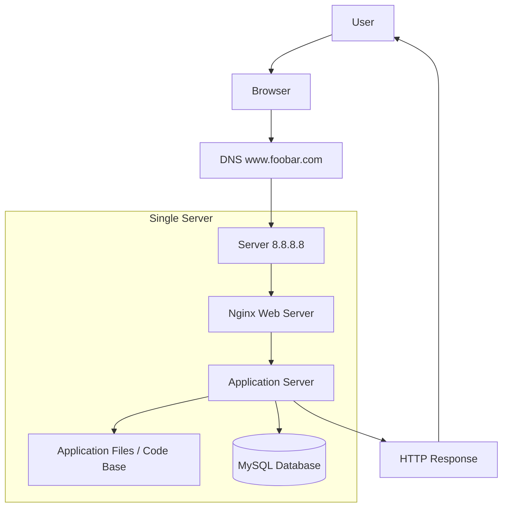

# Simple Web Stack

## Diagram

## Explanation

* One domain name (foobar.com) points to the server IP
* Nginx handles HTTP requests
* Application server processes logic
* MySQL stores application data
* Single server hosts all components

## Issues

* Single Point of Failure (SPOF)
* Downtime during maintenance
* Cannot scale easily
* Security limitations
