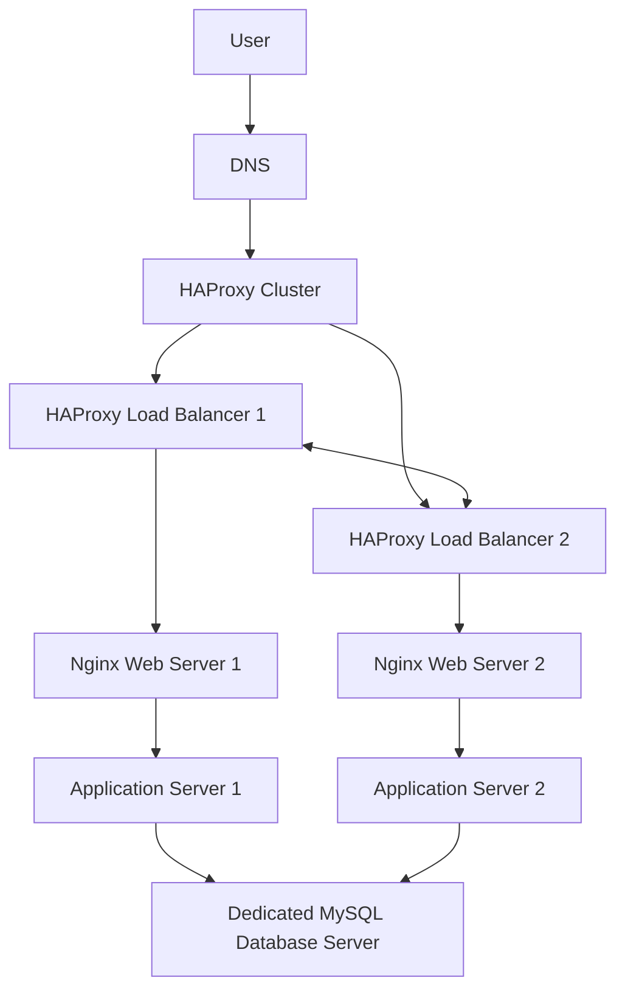

---
### `3-scale_up.md`

# Scale Up Infrastructure

## Diagram

## Explanation

* Two clustered load balancers improve redundancy
* Separate web tier handles HTTP traffic
* Separate app tier handles business logic
* Dedicated database tier improves performance
* Infrastructure supports scaling by tier

## Benefits

* High availability
* Better scalability
* Easier maintenance
* Improved security
* Tier isolation
